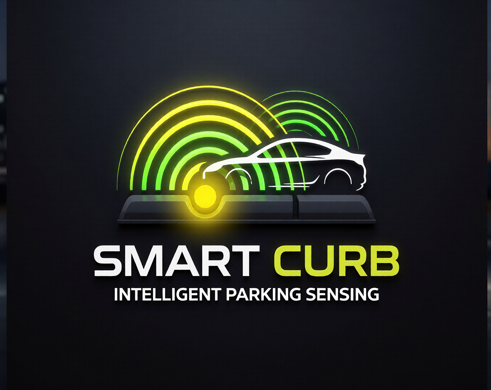
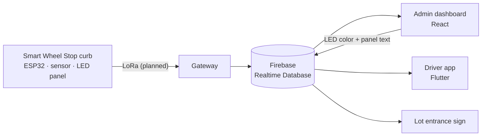

<p align="center">
  
</p>

<h1 align="center">Smart Wheel Stop</h1>

<p align="center">
  A solar-powered smart parking curb that knows when a spot is taken,<br>
  tells drivers where to go, and lets admins run every lot from one screen.
</p>

<p align="center">
  
  
  
  
  
  
</p>

<p align="center">
  <b>FAU Engineering Senior Design · Fall 2026 · Team Smart Curb</b><br>
  <a href="https://smartcurb-d174e.web.app">Admin dashboard</a> ·
  <a href="https://smartcurb-d174e--demo-azspi0b7.web.app">Live demo</a> (until Oct 31, 2026)
</p>

---

## The problem

Finding parking is slower and more stressful than it should be. A spot that looks open from the lane turns out to have a small car tucked into it. Permit signs are easy to miss, so it's not obvious which rows are red permit and which are blue. Drivers loop the same lots over and over, which means more traffic, more frustration, and more chances for a collision.

The Smart Wheel Stop replaces the ordinary concrete curb at the front of each parking space with one that **detects whether the spot is taken**, **shows the zone with a colored LED panel**, and **reports live to a central system** that drivers and staff can both see.

## How it works



1. Each curb senses whether a car is parked and reports its status, battery level, and health.
2. Everything lands in one shared Firebase Realtime Database.
3. The **driver app** shows which lots have room and routes drivers to the best one.
4. The **admin dashboard** shows every curb live, and can change any curb's LED color and panel text remotely, so a permit zone can be changed without repainting a single curb.
5. A **lot entrance sign** shows open spaces for drivers who aren't using the app.

## What's in the system

### Admin dashboard · `admin-dashboard/`

| Page | What it does |
|---|---|
| **Overview** | Live totals, occupancy for every lot, and alerts for offline curbs and low batteries |
| **Parking lots** | A tile for every curb, plus remote control of each curb's LED color and panel text |
| **Curb units** | Every curb in one table, with filters for offline, low battery, and open spots |
| **Lot sign** | A full-screen entrance sign view, built for a TV or projector |
| **Assistant** | Answers plain-language questions like *"where should I park?"* from live data |
| **Analytics** | Occupancy heatmap by day and hour, plus a live occupancy trend |
| **Users & roles** | Viewer, Operator, and Manager access, with invite-only sign-up |
| **Simulation** | Start, stop, and script the traffic simulator (shown in Simulation mode) |
| **Settings** | Change password, pick Live or Simulation data, set alert thresholds |

It updates in real time, works on phones and tablets, and has a built-in traffic simulator that never touches real curbs.

### Driver app · `smart_curb/`

A Flutter app with a map of campus lots showing live availability, with A\* routing that recommends the best lot for where the driver is headed.

### Hardware

Solar panels and rechargeable batteries power each curb. An ESP32 microcontroller reads an ultrasonic sensor and drives the LED panel. LoRa networking is planned for getting readings from the curbs to the database.

## Tech stack

| Layer | Technology |
|---|---|
| Admin dashboard | React, Vite, React Router |
| Driver app | Flutter |
| Backend | Firebase Authentication, Firebase Realtime Database, Firebase Hosting |
| Routing | A\* search |
| Curb hardware | ESP32, ultrasonic sensor, LED panel, solar + rechargeable batteries |
| Curb networking | LoRa (planned) |

## Repository layout

```
Smart_Curb/
├── admin-dashboard/        React admin console
│   ├── src/pages/          One file per page
│   ├── src/components/     Shared layout and animated numbers
│   ├── src/demo/           Demo data and traffic simulator
│   ├── scripts/            Deploy safety check
│   ├── database.rules.json Firebase security rules (draft, not published)
│   └── .env.demo           Settings for demo mode
├── smart_curb/             Flutter driver app
├── run_parking_test.py     A* parking algorithm test
└── README.md
```

## Getting started

### Admin dashboard

You'll need [Node.js](https://nodejs.org) (LTS version).

```bash
cd admin-dashboard
npm install
npm run dev
```

Open http://localhost:5173. Sign-up is invite-only: a Manager invites you from **Users & roles**, then you create your account with that exact email.

| Command | What it does |
|---|---|
| `npm run dev` | Run locally with real data |
| `npm run dev:demo` | Run locally as the demo site (simulated data only) |
| `npm run emulators` | Start local Auth + Database emulators with the draft rules (needs Java 21+) |
| `npm run dev:emulator` | Run locally against the emulators instead of the real database |
| `npm run build` | Build the real site into `dist/` |
| `npm run build:demo` | Build the demo site into `dist-demo/` |

### Driver app

You'll need the [Flutter SDK](https://docs.flutter.dev/get-started/install).

```bash
cd smart_curb
flutter pub get
flutter run -d chrome
```

On Windows, Flutter needs **Developer Mode** turned on (Settings → System → For developers).

### Deploying

From `admin-dashboard`, with the [Firebase CLI](https://firebase.google.com/docs/cli) installed:

```bash
# Real site (deploys dist/)
npm run build
firebase deploy --only hosting

# Demo site (deploys dist-demo/)
npm run build:demo
firebase --config firebase.demo.json hosting:channel:deploy demo --expires 30d
```

Real and demo builds go to different folders, and every build writes a `build-info.json`. Before any hosting deploy, `scripts/check-build.mjs` runs automatically and **blocks the deploy** if the folder holds the wrong kind of build (or no build at all). You can run the same check yourself with `npm run check:real` or `npm run check:demo`.

The security rules are not part of `firebase.json`, so `firebase deploy` can't publish them by accident. See *Security rules* below.

## Data model

```
lots/<lotId>
    name           "Lot 6"
    openSpots      7
    totalSpots     20
    units/         { "C-001": true, ... }

units/<curbId>
    lot            "lot06"
    occupied       true / false
    online         true / false
    battery        0 to 100
    ledColor       red | blue | green | gold | white
    panelText      up to 16 characters

users/<uid>        Dashboard accounts: email, role, last active
invites/<email>    Pending dashboard invites (dots in the email become commas)
drivers/<uid>      Driver app accounts
demo/              Same shape as above, used only for demos
```

A few rules keep everything in sync:

- A curb's `lot` must match its lot's ID **exactly**, including upper and lower case.
- Lot IDs are zero-padded (`lot06`, `lot07`) so they sort in the right order.
- Whoever changes a curb also updates that lot's `openSpots` and `totalSpots` **in the same write**, so the counts can never disagree with the curbs.

## Live and Simulation data

We have one real curb, so the dashboard can also show a full set of simulated curbs. The **Data source** switch (sidebar and Settings) picks what this browser shows:

- **Live** reads `units/` and `lots/`, where the hardware Receiver writes C-095.
- **Simulation** reads `demo/`. A blue banner stays on every page while it's on.

The simulator only ever writes under `demo/`, and refuses any write outside it, so it can't touch C-095 even if someone switches to Live while it runs (switching to Live also stops it). Only one browser can run the simulation at a time. The demo site (`npm run build:demo`) is locked to Simulation. The lot sign shows simulated data only when opened with `/sign?source=sim`.

The **Simulation** page provides:

| Control | What it does |
|---|---|
| **Start / Stop simulation** | Cars arrive and leave every two seconds, and every screen updates live |
| **Rush hour in Lot 6** | Fills Lot 6 almost instantly |
| **Take a curb offline** | Knocks a random curb offline to trigger an alert |
| **Bring all curbs online** | Restores every offline curb |
| **Load fresh simulated data** | Creates 94 curbs across Lots 6, 7, 12, and 14, plus a week of occupancy history |

## Security rules

`admin-dashboard/database.rules.json` is a **draft that has not been published**. It limits each role to what it should do, keeps driver accounts out of staff data, and only lets the Receiver write `occupied`, `lastUpdated`, and `lastSnapshot` on `units/`. The Receiver section has a placeholder that must be filled in once we know how the Receiver signs in; publishing before then would lock the Receiver out. Test changes locally with `npm run emulators`.

## Roles

| Role | Can do |
|---|---|
| **Viewer** | See occupancy, battery, and curb status |
| **Operator** | Everything a Viewer can, plus change LED colors and panel text |
| **Manager** | Everything, plus invite people and change roles |

## Working in this repo

- **Run `git pull` before you start**, every time.
- **`main`** is the real product. Work in progress goes on its own branch and comes into `main` through a pull request.
- If `git status` shows generated Flutter plugin files you didn't mean to change, run `git restore smart_curb` from the repo root before committing or switching branches.

## Roadmap

- [ ] Fill in the Receiver section and publish the Firebase security rules (test mode ends Oct 27)
- [ ] Receiver heartbeat, then turn on the stale-curb alert in Settings
- [ ] LoRa gateway writing live curb readings and lot counts
- [ ] LED control (Node 2) so dashboard LED changes reach the curb
- [ ] Exact GPS position for every curb, for spot-level navigation
- [ ] Separate data for each customer facility
- [ ] AI language model behind the Assistant
- [ ] Facility type and theme setup for new customers

## Team

| Name | Focus |
|---|---|
| Ryan Hart | Power, sensors, and hardware integration |
| Brad Middlebrook | A\* parking efficiency algorithm |
| Tuan Nhat Tran | Driver app, map, and routing |
| Tim Perez | Microcontroller and security |
| Naqib Chowdhury | Admin dashboard and system architecture |

<p align="center"><sub>Built at Florida Atlantic University</sub></p>